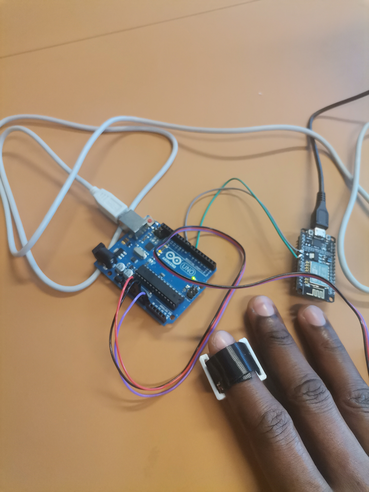

# wearable_pusle_monitoring
This is a working prototype project of a wearable pusle monitor system. Remotely monitoring of patients is gradually becoming a part of the healthcare system due to it importance in improving the quality and numbers of patients monitored simultaneously from a remote location. In this project, I have design and implemented a wearable heart rate sensor that can take reading of patients from anywhere in the world. Below were the components used to implement this project:

1. pulse sensor (SEN11574)
2.  ESP8266
3.  Arduino Uno
4.  Jumper wires and broadboard for prototyping

# Working Prototype of the project

# Prototyping of Project

# Pulse data sent remotely to Blynk App 

# Components and functions 
 
# Pulse sensor (SEN11574) Front and back view
The primary function of the SEN-11574 pulse sensor is to measure heart rate. The precise measurement of heartbeat rate is often a very challenging process, but with the aid of this pulse sensor, it has been much simpler. The finger is placed in front of this pulse sensor, the LED light's reflection changes depending on how much blood is flowing through capillaries at any given time. This implies that the blood volume in capillary capillaries will be high during the heartbeat and low afterward. Therefore, adjusting this volume alters the LED light. The pace of a finger's heartbeat can be detected by this change in LED light. This type of occurrence is referred described as a "photoplethysmogram."

 

# Arduino Uno
I introduced Arduino Uno into the connection with the ESP8266 to produce good result. The Analog port of the ESP8266 is not very efficient in processing data, hence the reason I interface the sensor with Arduino Uno which first process the data from the pulse sensor, then send the data serially to ESP8266 which function is to push the over the internet to the remote location of the Blynk App viewed on the mobile phone.

# ESP8266
The ESP8266 Wi-Fi module is mainly used for sending the data to a remote location which enable the data to be viewed on a Blynk App.

# Video showing data from the Pusle sensor display on serial monitor of Arduino IDE
https://github.com/JJJOSH/wearable_pusle_monitoring/blob/main/Working_Prototype_Video.mp4

# Data is received remotely and displayed on Blynk App
https://github.com/JJJOSH/wearable_pusle_monitoring/blob/main/working_prototype_Video2.mp4
   
# Conclusion
The SEN11574 pulse sensor, Arduino Uno, ESP8266 and Blynk IOT platform connected were efficiently used to monitor heart rate remotely. Blynk IOT platform also store the information in the cloud and provide means of extracting history of the data for future analysis. The platform also has strong security as only persons with login (username and password) details only have access to the patient’s health information saved on the cloud. The IOT platform also provides an App that could be install on mobile phone and has web version were data can be access at anytime from anywhere in the world. The project can be improved with the use of a lower power sensor with ESP8266 which could eliminate the use of Arduino and reduce the project size.
